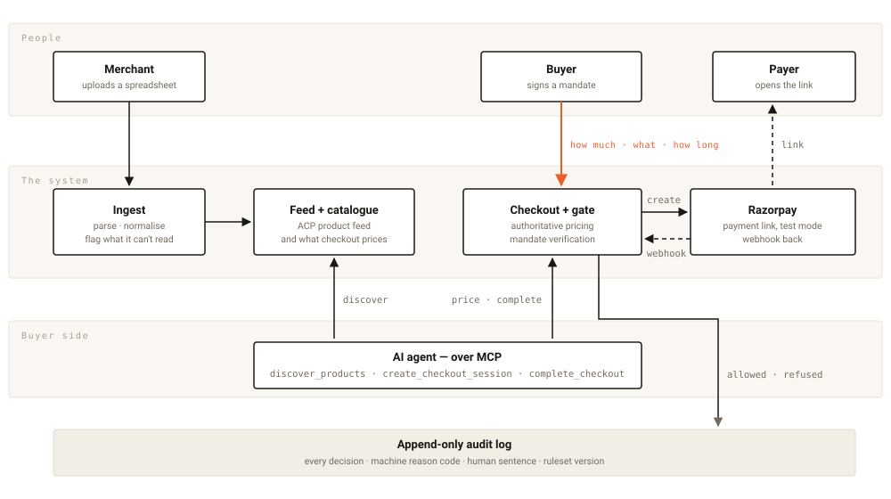
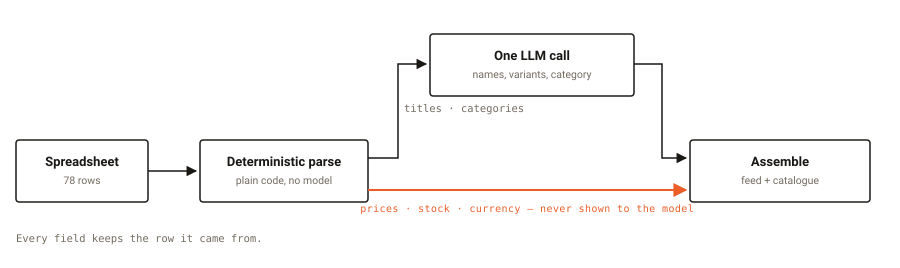
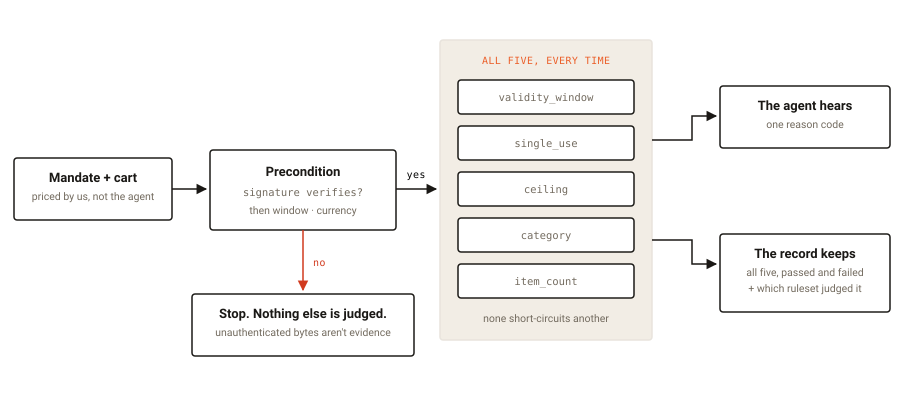
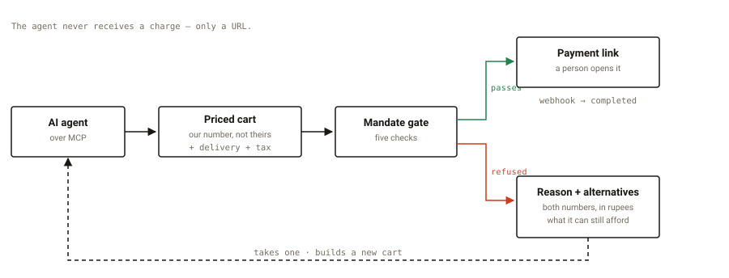

# agentready

**A merchant whose entire catalogue is a spreadsheet, made transactable by AI
buyers — with a gate that refuses a charge nobody authorised, and says why.**

Razorpay Buildathon, Track 1 (merchant side).
Live: **https://razorpaybuildathon-production.up.railway.app**

---

## The problem

A snacks shop in Chennai sells through WhatsApp, Instagram, and a Razorpay
link. Their inventory system is an `.xlsx` file — merged cells, prices written
eight different ways, notes above the header.

They cannot sell to an AI agent. Every agent-commerce standard assumes a
website, a product feed, and a platform to host them.

### Who this is for — and who it is not

Merchants already on a commerce platform are solved — Shopify merchants get
agent-readiness free via UCP and ACP, including Catalog APIs and MCP servers.
This project does not compete there. It targets merchants on **no platform at
all**, which is most of them.

Any feature that only makes sense for a merchant who already has a website is
rejected in review. That drift rebuilds Shopify's product with none of
Shopify's resources.

---

## What it does

<picture>
  <source media="(prefers-color-scheme: dark)" srcset="docs/diagrams/system-dark.svg">
  
</picture>

A spreadsheet goes in on the left. An agent works from underneath. A person
signs the spending authority at the top — that is the orange edge, and it is
the only thing that gives an agent permission to spend. Everything any of them
did ends up on the record at the bottom.

| | |
|---|---|
| **Ingest** | A messy spreadsheet → normalized products, every field tracing to its source row |
| **Feed** | An ACP product feed agents can read |
| **Checkout** | ACP checkout sessions, authoritative pricing, Razorpay test-mode payment links |
| **Mandates** | Signed authority: ceiling, category, item count, validity window, single-use |
| **Audit** | Append-only log of every decision, with a machine reason code and a human string |
| **MCP** | Three tools — discover, create session, complete |
| **Dashboard** | Four pages: the transformation, the products held back with the reason and the sheet row, and every decision a checkout made |

---

## The model reads meaning. Ordinary code reads money.

<picture>
  <source media="(prefers-color-scheme: dark)" srcset="docs/diagrams/money-split-dark.svg">
  
</picture>

Prices, stock and currency are parsed before the model runs, and it is never
shown them. Invariant 1 is therefore structural rather than a promise: the model
cannot influence an amount it is never asked to emit. `₹ 65/Kg` became 6500
paise with no model involved.

Which is also why the alternative finder is not a recommender — a ranking model
there is *a model adjacent to the charge decision*.

---

## No payment call executes without a valid mandate

<picture>
  <source media="(prefers-color-scheme: dark)" srcset="docs/diagrams/gate-dark.svg">
  
</picture>

The signature is a **precondition**, not a sixth check. If it does not verify,
the mandate's contents are unauthenticated bytes — computing a ceiling
comparison from them is not merely impolite, it is meaningless, and recording
that it "passed" would be a lie about evidence we do not have.

If it verifies, all five checks run, every time, none short-circuiting another.
Then two audiences are told two different amounts — see
[the gate refuses one thing and records everything](#the-gate-refuses-one-thing-and-records-everything).

---

## Ninety seconds

```bash
npm run dev          # terminal 1
npm run demo         # terminal 2
```

Or against the deployed site, with no local server at all:

```bash
AGENTREADY_BASE_URL=https://razorpaybuildathon-production.up.railway.app npm run demo
```

An agent discovers murukku from a real Chennai snacks catalogue, buys one, then
hits a price that moved under it:

```
refused     MANDATE_CEILING_EXCEEDED
            Cart total 14826 exceeds mandate ceiling 11235
retryable   false
alternatives  Ribbon Murukku 5700, Butter Murukku 5700
→ takes one → complete_in_progress → payable URL
```

The script prints an audit-trail URL. That page is the deliverable for
"explainable": the refusal, both numbers in rupees, the price drift that caused
it, and **the four checks that passed beside the one that failed**.

---

## What happens after "no"

<picture>
  <source media="(prefers-color-scheme: dark)" srcset="docs/diagrams/failure-path-dark.svg">
  
</picture>

The dashed edge is the failure path. Without it a refusal is a dead end and the
merchant loses a sale they could have made. Alternatives are priced through the
same totals function the gate uses, so nothing offered is something the gate
would then refuse — an earlier version compared bare item prices against the
ceiling and offered carts that failed once tax landed.

---

## Normalization accuracy

**100% (470/470 field observations) on 78 products transcribed from one Chennai
snacks seller's public IndiaMART listing, with labels hand-written by us.**

That sentence is the whole claim, and the qualifiers are not footnotes. One
shop, one trade, author-written labels. `docs/NORMALIZATION-EVAL.md` carries
every run with its prompt fingerprint — 95% → 99% → 100% — because a number that
moved shows what the eval caught, and a number alone does not.

**Category accuracy from this fixture measures nothing**: every row is `food`,
so it reads 100% regardless of what the pipeline does. The document detects
single-valued fields and says so itself.

---

## The rule this project runs on

Three test suites in three days looked like coverage and could not fail:

- 32 mandate-check combinations that derived their expectation from the rule
  they appeared to test
- an alternatives suite whose fixture held no over-budget candidate
- and then one whose fixture held no over-budget-**once-taxed** candidate

Each was written alongside the fix it tested, so each agreed with the fix by
construction. All three were found the same way.

> **Breaking the code on purpose is the only thing that separates coverage from
> decoration.** The question is not "is there another test to write" — it is
> *what do I break to make this go red*, asked before trusting a test.

`docs/OBSTACLES.md` is the long version: every defect, what it cost, and what
found it. Most of them were found by driving the thing, not by testing it.

---

## Invariants

1. **The LLM never decides to charge.** It normalizes catalogues. Mandate
   verification and payment execution are deterministic code with no model in
   the path — which is also why the alternative finder is not a recommender: a
   ranking model there is *a model adjacent to the charge decision*.
2. **No payment call executes without a valid mandate.** Signature, then
   validity window, single-use, ceiling, category, item count.
3. **Every refusal is logged** with a machine reason code and a human string.
4. **No blind retry.** Transport failures retry with idempotency keys; a mandate
   refusal never does.
5. **Test mode only.** No live Razorpay keys, ever.
6. **Amounts are integers in minor units.** Never floats, never rupees.
7. **Every normalized product traces to its source row.**

### Discovery is public; transacting is not

`GET /feeds/{id}` and `GET /feeds/{id}/products` require no credential. This is
a decision, not an omission: a credential wall in front of a price list makes a
merchant invisible to the agents that would buy from them, and the friction
lands before any value is exchanged. The catalogue is published to be read.

Authentication begins where money does. Creating a session and completing one
require an agent credential, and completing one additionally requires a signed
mandate. The MCP server's `discover_products` therefore sends no `Authorization`
header — carrying one implied a protection that does not exist, and it masked a
real credential bug behind a browse that succeeded anyway.

### The gate refuses one thing and records everything

The caller gets one reason code — minimal, no enumeration of everything wrong
with a mandate somebody may be probing. The audit event records **every check
that failed and every check that passed**, so the record does not depend on the
order the checks ran in. The passed set is evidence: in a dispute, *"the
ceiling, the category and the item count were within bounds"* is a statement and
silence is not.

Every row carries a `gate_version`. If the check set ever changes, rows written
before and after must remain distinguishable, or the trail stops being readable
over time.

---

## Declared deviations from ACP

Honest deviations, not silent ones.

- **`payment_data` carries `handler_id` alone.** ACP's `PaymentData` is
  `anyOf: [{handler_id, instrument}, {purchase_order_number}]`; both branches
  assume the agent hands over a credential. This handler declares
  `requires_delegate_payment: false` — the artifact is a URL travelling the
  other way. The extension mechanism cannot rescue it: `ExtensionDeclaration.extends`
  names `$.<Schema>.<field>` as the way to add fields, and `PaymentData` sets
  `additionalProperties: false`, which rejects exactly that. The two shapes that
  *do* validate were rejected as fabrications — `credential.token: "n/a"` invents
  a credential, and `purchase_order_number` means a buyer-issued PO, not a slot
  for a session id.
- **Mandates travel in a header**, for the same reason: no conformant place in
  the body for a field ACP does not define.
- **`alternatives` rides on the ACP `Error`.** `Error` sets
  `additionalProperties: false`, so a refusal carrying recovery data does not
  conform. This is the only deviation on the RESPONSE side and it is the more
  serious kind: an agent validating our response against the schema would reject
  it, where a request-side extension only affects what we accept. Kept because a
  refusal an agent cannot act on is a dead end, and reported explicitly by
  `npm run conformance` rather than hidden.
- **Request signing is ours.** ACP's `Signature` header is `required: false`
  with no algorithm beyond the word "HMAC", no canonicalisation, no signing base
  and no key distribution — two conformant implementations cannot verify each
  other. So the scheme is defined here and declared, not presented as conformance.

## Not implemented

- Real delegated payment tokens — Razorpay is not a Delegated Payment Spec PSP
- Tax configuration beyond a flat 5% stub, and flat-rate delivery
- Asymmetric mandate signing. HMAC with a shared secret means the verifier could
  have issued what it verifies. Sound for a seller issuing on a buyer's
  instruction; not sound for the arrangement a mandate ultimately wants
- Agent auth scopes, rotation, delegation. It is a signed-credential check, not
  an identity system
- **Merchant authentication.** The buyer side is credentialed end to end;
  the merchant side is not: `POST /api/ingest` and the dashboard pages
  (`/sessions`, `/upload`) are open in this build, so anyone who can reach the
  server can upload a catalogue or read the audit trail. Fine on localhost,
  stated here because it is not fine anywhere else. Mandate issuance is the
  exception — `POST /api/mandates` requires the agent credential, closing the
  hole where a stranger could mint spending authority without holding anything
- OpenAI conformance certification

---

## Setup

```bash
npm install
cp .env.example .env      # fill in the keys named there
npm run agent:issue -- agent_demo mer_live "demo"   # prints a token for .env
npm test
```

`DATABASE_URL` takes any Postgres. Razorpay keys must start `rzp_test_` — the
code refuses anything else.

### Conformance

```bash
npm run dev          # terminal 1
npm run conformance  # terminal 2
```

Validates what actually came back over HTTP against the pinned ACP schemas —
not the objects before serialisation, which is a different claim. Covers the
error shapes too, which in-process validation never sees. Exits non-zero on any
failure; declared deviations are reported as their own line rather than passing
silently.

## Layout

```
lib/ingest      spreadsheet → rows, with reasons for anything skipped
lib/normalize   one structured LLM call, provider swappable behind a seam
lib/feed        ACP feed projection; withheld records are never silently dropped
lib/checkout    ACP sessions, totals, Razorpay links, webhooks
lib/mandate     the gate, the signing seam, single-use consumption
lib/audit       append-only decision log
mcp/server.ts   three tools, speaking HTTP to this API like any other client
app/            four pages, in the order the story runs:
                  /            what this is, over live counts and the last real refusal
                  /upload      a sheet in, with row counts rather than a spinner
                  /catalogue   what the sheet became — and every row held back, with why
                  /sessions    the audit trail: the refusal, both numbers, the checks
                               that passed beside the one that failed
docs/OBSTACLES.md   what broke, what it cost, what found it
```
